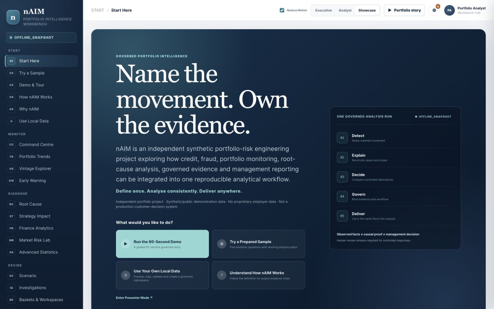
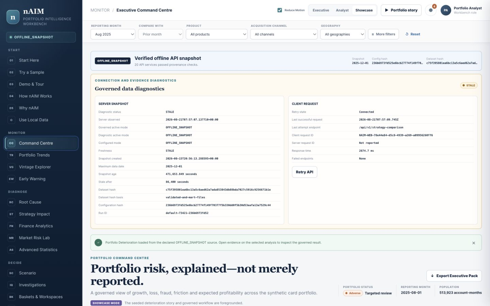
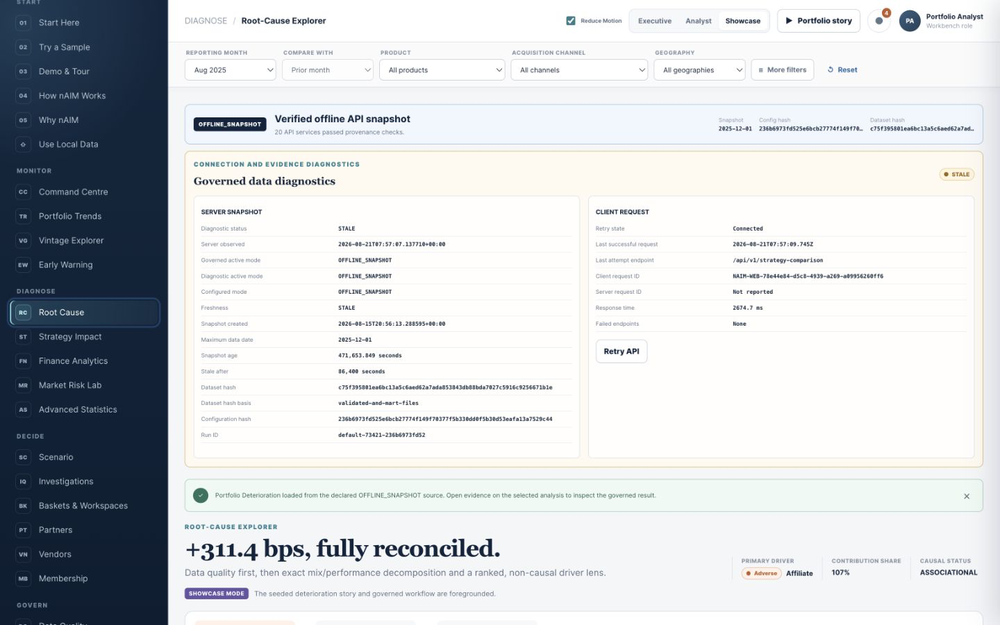
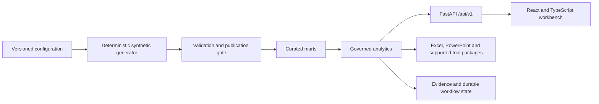

# nAIM Portfolio Intelligence Workbench

An independent synthetic portfolio-risk engineering project exploring credit,
fraud, portfolio monitoring, root-cause analysis, governed evidence and
management reporting.

> **Name the movement. Own the evidence.**

nAIM (pronounced “name”; AIM means **All Is Mine**) connects deterministic
portfolio data, governed calculations, analytical review, durable alerts and
editable management reporting in one reproducible local workflow.

**Independent portfolio project. Synthetic/public demonstration data. No
proprietary employer data. Not a production customer-decision system.**

## Quick start

```bash
make start
```

Open <http://localhost:3000>. The API health endpoint is
<http://127.0.0.1:8000/api/v1/health>.

On a fresh clone, install the local dependencies once before starting:

```bash
make setup
make start
```

Requirements: Python 3.12+, Node.js 22.13+, npm, and roughly 2 GB of local
space. Docker is optional and is not required for the standard workflow.

Useful lifecycle commands:

```bash
make status
make restart
make logs
make stop
```

`make start` safely initializes the local workflow database, reuses or builds
the requested governed dataset, starts both services, waits for health and
opens the workbench unless `NO_OPEN=1` is supplied.

## What it demonstrates

- portfolio monitoring with explicit scope, period, data mode and data quality;
- governed credit- and fraud-risk KPIs with units, denominators and lineage;
- portfolio trends, roll rates and maturity-aligned vintage analysis;
- champion–challenger strategy comparison with operational guardrails;
- exact mix/performance root-cause decomposition with a zero-residual check;
- durable early-warning alerts, audit history and investigation linkage;
- transparent scenarios with versioned assumptions;
- data-quality gating and reproducible run manifests;
- editable Excel and PowerPoint reporting plus honest enterprise-tool packages.

The workbench separates observed facts, associational evidence and management
decisions. It does not automate customer-level credit decisions.

## Demo story

From **Start Here**, select **Run the 60-Second Demo** or open **Try a Sample**.
The governed story uses the synthetic August 2025 versus July 2025 portfolio:

1. confirm scope, provenance and the publication gate;
2. name the material loss-rate movement;
3. reconcile mix and within-segment performance;
4. identify the Affiliate contribution without claiming causality;
5. review maturity-aligned vintages and strategy trade-offs;
6. inspect the durable warning and investigation record;
7. carry the same evidence into the Executive Pack.

The demo supports play, pause, resume, previous, next, stage selection, restart,
Presenter Mode and Reduce Motion. Values come from the governed API/evidence
state; the interface does not silently replace unavailable results.

## Screenshots

### Start Here



### Command Centre



### Root Cause



## Architecture



The default profile contains 25,000 synthetic accounts and 513,923 governed
account-month observations. Generated raw, validated and curated datasets are
excluded from Git; the deterministic pipeline and configuration needed to
rebuild them are included.

## Technology

- Python 3.12, FastAPI, Pydantic, pandas, NumPy, PyArrow and DuckDB;
- SciPy, scikit-learn and statsmodels for the methods explicitly exposed;
- React 19, TypeScript, Vite/vinext and responsive CSS;
- Parquet analytical layers, versioned JSON registries and OpenAPI;
- editable `.xlsx` and `.pptx` outputs;
- pytest, Hypothesis, Ruff, Node tests, TypeScript, ESLint and GitHub Actions.

## Validation

The release process fails closed when source, tests, browser evidence, manifests
or analytical artifacts do not agree. The final release validation summary is
published with the GitHub release rather than maintained as an unbound README
counter.

Local verification commands:

```bash
make test PYTHON=.venv/bin/python
make lint PYTHON=.venv/bin/python
PYTHONPATH=src .venv/bin/python scripts/run_release_tests.py
```

The governed default snapshot must report data-quality `PASS` and publication
allowed before analytical results or release artifacts can be promoted.

## Repository map

```text
app/             React workbench and route views
config/          Versioned profiles, metrics, alerts and scenarios
src/naim_risk/   Generator, validation, marts, analytics and API service
scripts/         Lifecycle, pipeline, export and release commands
tests/           Backend, frontend, data-quality and release verification
docs/            Architecture, methodology, governance and user guidance
exports/         Reviewable enterprise-tool compatibility sources
```

## Security and privacy

- Synthetic records only; no customer PII or employer data.
- Local deterministic commentary; no external AI service is required.
- No browser-supplied raw SQL.
- Export and download paths are allowlisted, tokenised where applicable and
  hash-checked.
- Generated data, local databases, logs, PID state, environments and dependency
  directories are excluded from Git.

## Limitations

- This is a single-machine analytical workbench, not a multi-user banking
  platform or production warehouse.
- The bundled offline snapshot is deliberately reproducible and may be marked
  stale by the freshness diagnostic; that state remains visible.
- Strategy comparisons are associational because synthetic eligibility is not
  a randomized production experiment.
- Scenario results are assumption-driven planning estimates, not validated
  forecasts.
- Power BI, Tableau and SAS packages are statically validated; their licensed
  desktop runtimes and publication services are not bundled.
- Authentication, authorization and operational controls are local-development
  demonstrations, not a production security boundary.
- Optional external-data and SHAP paths remain explicitly labelled
  `INTEGRATION_ONLY` when no executable provider is present.

See [docs/limitations.md](docs/limitations.md) and
[docs/analytical_methodology.md](docs/analytical_methodology.md) for the full
method and control boundaries.

## License

MIT. See [LICENSE](LICENSE).
