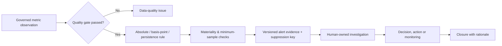

# Early-Warning and Investigation Framework

## Workflow

## Executable methods

The current local engine executes absolute thresholds, basis-point movement,
persistent increase, data-quality gates and minimum denominators. Each emitted
alert records its rule version, configured persistence/cooldown values and a
deterministic duplicate-suppression key.

## Current boundary and extension path

Cooldown, durable cross-run deduplication, parent-child suppression, exception
windows, escalation and SLA enforcement require a state/history store and are
not implemented by the in-memory demonstration engine. The recorded metadata
and suppression key are the contract for adding those controls without changing
the analytical evidence schema. Data-quality alerts remain separate from
business-deterioration alerts.

## Evidence contract

An alert includes metric ID/version, current and baseline values, numerator/denominator, threshold, comparison, filters or basket version, sample size, materiality, uncertainty, data-quality status, contributing segments, source run, created time, owner, state and recommended next diagnostic.

## Human control

Alerts recommend investigation, not automatic portfolio tightening. The API
supports in-process investigation creation and updates with audit timestamps.
Durable persistence, enforced workflow transitions, attachment storage and
cross-session SLA management are production extensions.
