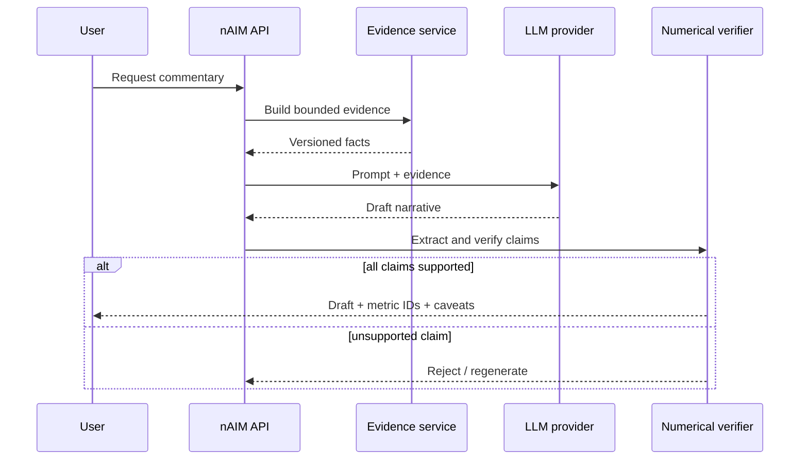

# API Guide

## Contract principles

The API is versioned, filterable and evidence-first. Responses never depend on display formatting. Rates are decimals in the API; clients choose percent or basis-point presentation. Synthetic identifiers are masked unless an authorized analyst requests bounded detail.

## Representative resources

| Method | Resource | Purpose |
|---|---|---|
| `GET` | `/api/v1/health` | service and dependency health |
| `GET` | `/api/v1/metadata` | run, metric and configuration versions |
| `GET` | `/api/v1/metrics` | metric registry |
| `GET` | `/api/v1/portfolio/summary` | KPI evidence for a period/filter |
| `GET` | `/api/v1/portfolio/trends` | numerator/denominator time series |
| `GET` | `/api/v1/vintages` | maturity-aligned cohorts |
| `GET` | `/api/v1/root-cause` | reconciled decomposition |
| `GET` | `/api/v1/strategies` | comparison and validity checks |
| `GET` | `/api/v1/alerts` | alert evidence and state |
| `GET/POST` | `/api/v1/investigations` | investigation workflow |
| `GET/POST` | `/api/v1/baskets` | versioned basket definitions |
| `GET/POST` | `/api/v1/workspaces` | reusable analysis configurations |
| `POST` | `/api/v1/scenarios/run` | controlled scenario calculation |
| `POST` | `/api/v1/commentary` | draft narrative from evidence |
| `GET` | `/api/v1/exports/{type}` | governed export manifest |

## Query conventions

Use ISO dates and repeatable dimension filters. A request should state reporting period, comparison period, metric IDs, dimensions, basket/workspace version and scenario where applicable. Pagination uses stable cursors. Responses include `request_id`, `run_id`, `as_of`, `metric_version`, `configuration_hash`, `data_quality_status`, `synthetic_data_flag` and lineage.

## Error model

Errors return a stable code, readable message, request ID and safe details. Common codes include `INVALID_FILTER`, `INSUFFICIENT_SAMPLE`, `DATA_QUALITY_BLOCKED`, `VERSION_CONFLICT`, `NOT_APPROVED`, `RATE_LIMITED` and `EXPORT_NOT_READY`. Validation errors are `422`; conflicts are `409`; unavailable evidence is `503`.

## Commentary control flow

The generated OpenAPI document is the endpoint authority when the backend is running; this guide describes the intended interoperability contract.

