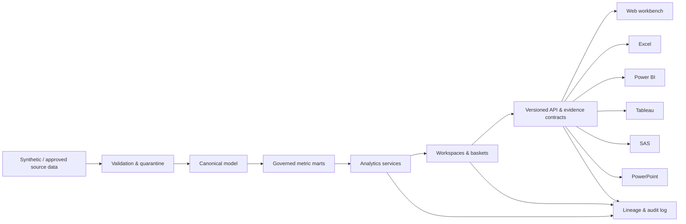
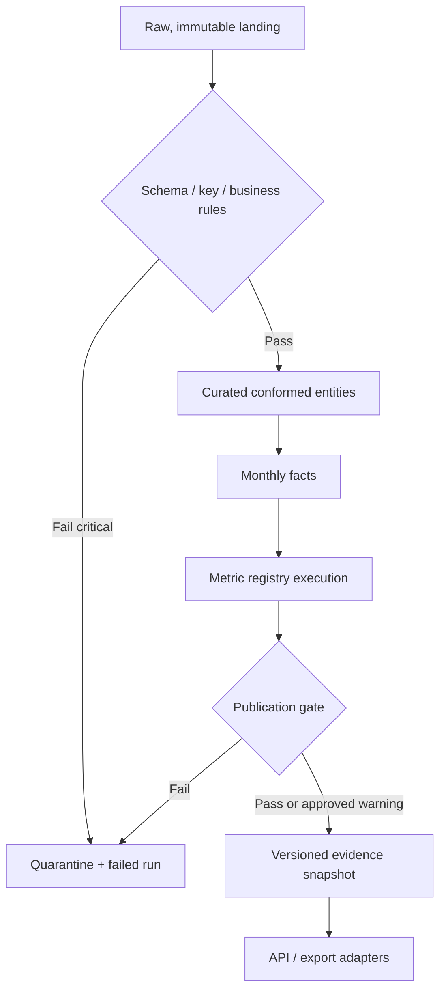
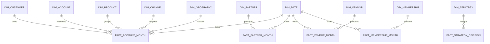

# Architecture

nAIM is the governed analytical layer between institution-neutral source data and enterprise consumption tools. The browser and exports consume the same versioned evidence contract.

## System architecture

## Data flow

## Analytical star schema

## Trust boundaries

Source ingestion, calculation, evidence generation and consumption are separate boundaries. Only validated, aggregated evidence reaches executive views. Configuration writes require schema/range/version validation, impact preview and approval. LLM providers receive bounded evidence, never raw customer records.

## Deployment shape

The preferred demo topology is a web client, typed API, analytical service, DuckDB/Parquet analytical store and local configuration registry. Production adoption should replace the development authentication stub, local secrets and single-node storage with institution-approved identity, key management, database, scheduler and observability services.

