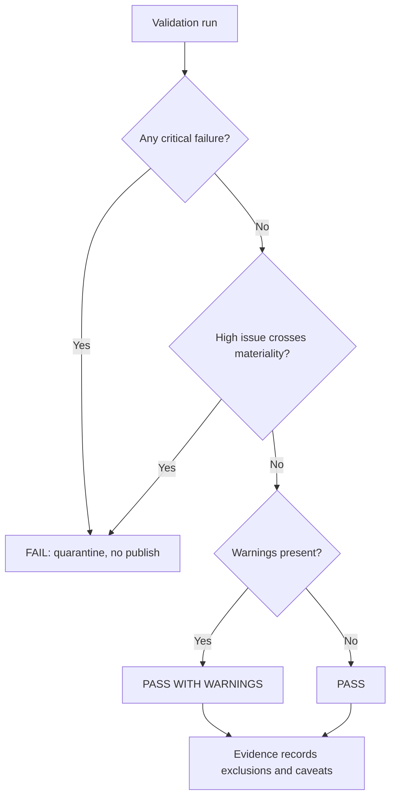

# Data Quality Framework

## Control layers

| Layer | Examples | Gate |
|---|---|---|
| Schema | required columns, types, date formats, enums | critical failures stop ingestion |
| Keys | uniqueness, referential integrity, monthly grain | duplicates stop publication |
| Business rules | balance/limit logic, DPD bounds, effective strategy | severity-based |
| Reconciliation | source totals, numerator/denominator, bridge identity | tolerance-based |
| Freshness | reporting close, late arrivals, expected partitions | warning or fail |
| Completeness | row count, nulls, partner/vendor invoices | impact assessed |

## Publication gate

## Required evidence

Each check stores check ID/version, affected table and columns, observed result, threshold, affected rows and share, severity, disposition, quarantine path, owner, execution time and run ID. A warning may publish only when its measured metric impact remains below the configured tolerance and the caveat is propagated.

## Formula-injection control

Text values beginning with `=`, `+`, `-`, `@`, tab or carriage return are escaped before CSV or spreadsheet export. Executive views mask identifiers; detail downloads are role-limited, row-limited and logged.

## Reconciliation standard

Key totals reconcile raw → curated → mart → API → export. Differences are classified as expected exclusions, rounding, late-arrival delta or error. Undocumented residuals fail the gate.

