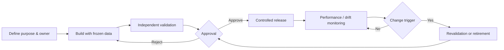

# Model and Analytical Governance

## Lifecycle

## Inventory and tiering

Each model or analytical template records purpose, owner, users, inputs, outputs, materiality tier, methodology, training/validation windows, limitations, approval, implementation version and retirement status. Deterministic metric formulas and rating scorecards are governed analytical components even when they are not statistical models.

## Minimum controls

- Independent code/formula review and benchmark comparison.
- Frozen validation data and repeatable run manifest.
- Discrimination, calibration, stability and segment performance where relevant.
- Champion/challenger comparisons with operational and profit guardrails.
- Drift thresholds, monitoring cadence and escalation owner.
- Override reason, approver and expiry.
- Change-impact analysis across metrics, workspaces, reports, ratings and alerts.

## Controlled AI

LLM commentary is not a calculation model. It receives bounded evidence; may summarize, prioritize and suggest investigations; may not invent numbers, claim causality or approve an action. A verifier compares every numerical claim with the evidence object. Output is stored with provider, model, prompt version, timestamp and `DRAFT—HUMAN REVIEW REQUIRED`.

## Validation outcome

Outcomes are approved, approved with conditions, remediation required or rejected. Unresolved high-severity findings prevent production approval. Demo artifacts are synthetic and do not represent institutional validation.

