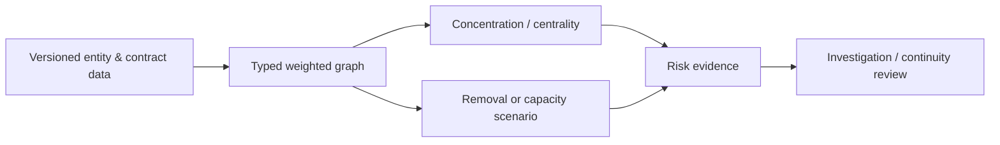

# Network and Dependency Methodology

## Graph definition

Nodes represent products, membership tiers, partners, vendors, services, processes, regions or benefits. Directed edges represent dependency or flow; edge weights declare transaction value, volume, cost, exposure or criticality. Different units are never combined without a documented normalization.

## Measures

Degree/weighted degree identify direct concentration; betweenness highlights intermediaries; connected components reveal isolated clusters; dependency share measures exposure to a node; scenario removal estimates first- and controlled second-order impact.

## Workflow

## Caveats

Centrality is structural, not a probability of failure. Missing fourth-party links understate risk. Removal scenarios require substitutability, spare capacity, geography, contract, transition time and control quality; they are not operational instructions.

## Governance

Graph definition, edge type, weight normalization, threshold and scenario assumptions are versioned. Material network changes trigger concentration and business-continuity review.

